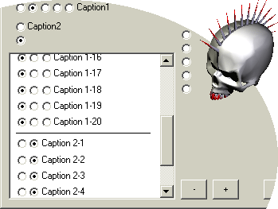



## uSc\_MultiOption

### Description

[v 1.01]

This is a control that provide selection one of more options. It's builded from standard option button control but instead of true/false it returns an index of selected option.

It's usefull when you need many options controls.
 
### More Info
 

             |
---                |---
**Submitted On**   |2003-05-22 14:00:22
**By**             |[uScream](https://github.com/Planet-Source-Code/PSCIndex/blob/master/ByAuthor/uscream.md)
**Level**          |Intermediate
**User Rating**    |5.0 (10 globes from 2 users)
**Compatibility**  |VB 5\.0, VB 6\.0
**Category**       |[Custom Controls/ Forms/  Menus](https://github.com/Planet-Source-Code/PSCIndex/blob/master/ByCategory/custom-controls-forms-menus__1-4.md)
**World**          |[Visual Basic](https://github.com/Planet-Source-Code/PSCIndex/blob/master/ByWorld/visual-basic.md)
**Archive File**   |[uSc\_MultiO1592915272003\.zip](https://github.com/Planet-Source-Code/uscream-usc-multioption__1-45671/archive/master.zip)

